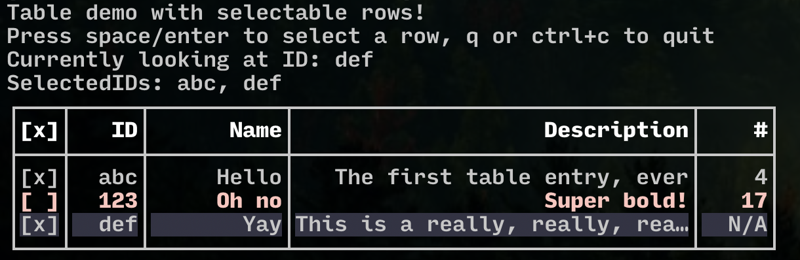

# Bubble-table

<p>
  <a href="https://github.com/Evertras/bubble-table/releases"></a>
  <a href="https://pkg.go.dev/github.com/Evertras/bubble-table?tab=doc"></a>
</p>

A table component for the [Bubble Tea framework](https://github.com/charmbracelet/bubbletea).



[View sample source code](./examples/features/main.go)

## Features

For a code reference, please see the [full feature example](./examples/features/main.go).

Displays a table with a header, rows, and borders.

Border shape is customizable with a basic thick square default.

Rows can be individually styled.

Can be focused to highlight a row and navigate with up/down (and j/k).

Can make rows selectable, and fetch the current selections.

## Demos

Code examples are located in [the examples directory](./examples).  Run commands
are added to the [Makefile](Makefile) for convenience but they should be as
simple as `go run ./examples/features/main.go`, etc.

To run the examples, clone this repo and run:

```bash
# Run the full feature demo
make

# Run the example
make dimensions

# Or run any of them directly
go run ./examples/features/main.go
```

## Contributing

Contributions welcome, but since this is being actively developed for use in
[Khan](https://github.com/evertras/khan) please check first by opening an issue
or commenting on an existing one!

